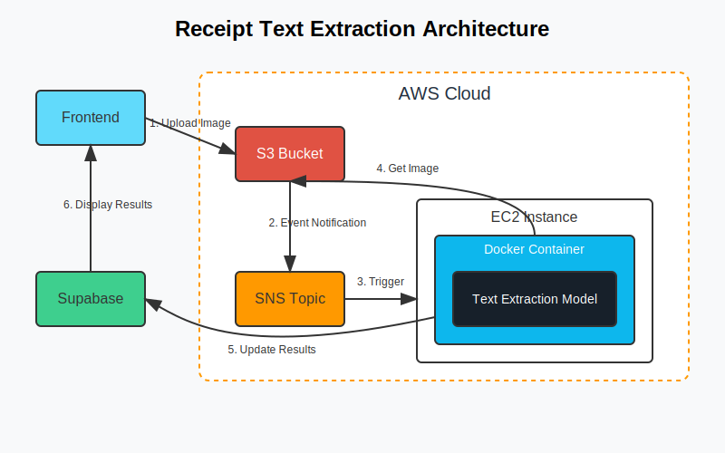

# Receipt Text Extractor Service

This project provides a complete solution for extracting text from receipt images using a custom model approach. It includes:

1. A Python-based text extraction service
2. Docker containerization
3. AWS infrastructure setup for deployment
4. Integration with Supabase database

## Architecture Overview



The solution follows this workflow:

1. Users upload receipt images through the frontend to AWS S3
2. S3 event notifications trigger the receipt processing
3. The custom text extraction model processes the images
4. Extracted information is stored back in Supabase database
5. The frontend displays the processed receipt data

## Components

### 1. Text Extraction Model

The custom text extraction model in `receipt_extractor.py` uses computer vision techniques to:

- Preprocess the image for better text detection
- Detect text regions in the receipt
- Recognize text in these regions
- Extract structured information (store name, total, date, items)

### 2. Flask API

The API in `app.py` provides endpoints for:

- `GET /health`: Service health check
- `POST /process`: Direct receipt processing
- `POST /process-webhook`: Webhook for S3 event notifications

### 3. AWS Infrastructure

The solution uses several AWS services:

- **S3**: Stores the uploaded receipt images
- **SNS**: Handles event notifications when images are uploaded
- **EC2**: Hosts the text extraction service
- **CloudFormation**: Automates the infrastructure deployment

## Setup and Deployment

### Option 1: Manual Setup

1. **Set up EC2 instance**:
   ```bash
   # SSH into your EC2 instance
   ssh -i your-key.pem ubuntu@your-ec2-instance-ip
   
   # Run the deployment script
   curl -L https://raw.githubusercontent.com/your-username/receipt-extractor/main/deploy.sh | bash
   ```

2. **Configure your environment**:
   ```bash
   cd ~/receipt-extractor
   cp .env.template .env
   # Edit .env with your credentials
   nano .env
   ```

3. **Copy the application files**:
   Copy the following files to the ~/receipt-extractor directory:
   - app.py
   - receipt_extractor.py
   - requirements.txt
   - Dockerfile

4. **Build and start the service**:
   ```bash
   docker-compose up -d
   ```

5. **Set up S3 event notifications**:
   ```bash
   export S3_BUCKET_NAME=ved-receipt-images-app
   export EC2_INSTANCE_PUBLIC_DNS=your-ec2-instance-public-dns
   ./setup-s3-events.sh
   ```

### Option 2: CloudFormation Deployment

1. **Download the CloudFormation template**:
   Save the `cloudformation-template.yml` file to your computer.

2. **Deploy the stack through AWS Console**:
   - Go to the AWS CloudFormation console
   - Click "Create stack" and select "With new resources"
   - Upload the template file
   - Fill in the required parameters (S3 bucket name, Supabase URL, etc.)
   - Click "Create stack" and wait for the deployment to complete

3. **Access the deployed service**:
   - When the stack creation is complete, check the Outputs tab for:
     - `InstancePublicDnsName`: The public DNS of your EC2 instance
     - `ProcessEndpoint`: The endpoint for direct receipt processing
     - `WebhookEndpoint`: The webhook endpoint for S3 events

## Integration with Frontend

Update your frontend to use the S3 bucket for uploads and the Supabase database for storage.

1. **Update environment variables** in your frontend:
   ```
   REACT_APP_S3_BUCKET_NAME=ved-receipt-images-app
   REACT_APP_AWS_REGION=ap-southeast-1
   ```

2. **No code changes needed** if you're using the existing upload logic, as the extraction service will automatically update the Supabase database when new images are uploaded.

## Custom Model Details

The current implementation uses a simplified approach for text extraction that includes:

1. **Image Preprocessing**:
   - Resizing and normalization
   - Grayscale conversion
   - Adaptive thresholding
   - Denoising

2. **Text Detection**:
   - In a production version, this would use a Deep Learning model like CRAFT (Character Region Awareness for Text Detection)
   - Current implementation uses a simplified approach for demonstration

3. **Text Recognition**:
   - In a production version, this would use a CRNN (Convolutional Recurrent Neural Network) model
   - Current implementation uses a placeholder for demonstration

4. **Information Extraction**:
   - Rule-based parsing of the extracted text
   - Extraction of store name, total amount, date, and items

## Enhancing the Model

To enhance the text extraction capabilities:

1. **Implement a proper CRAFT model** for text detection:
   ```python
   # In receipt_extractor.py
   def load_craft_model(self):
       import craft_text_detector
       model = craft_text_detector.Craft(
           output_dir="outputs",
           crop_type="box",
           cuda=torch.cuda.is_available()
       )
       return model
   ```

2. **Implement a proper OCR model** for text recognition:
   ```python
   # In receipt_extractor.py
   def load_recognition_model(self):
       # Example using a pre-trained CRNN model
       from crnn_model import CRNN
       model = CRNN(
           img_h=32,
           nc=1,
           nclass=37,
           nh=256
       )
       model.load_state_dict(torch.load('path/to/model.pth'))
       model.eval()
       return model
   ```

## Troubleshooting

1. **S3 Event Notifications Not Working**:
   - Check SNS subscription status
   - Ensure EC2 security group allows inbound traffic on port 5000
   - Check EC2 instance logs: `docker-compose logs -f`

2. **Model Not Extracting Text Correctly**:
   - Adjust preprocessing parameters for different receipt types
   - Fine-tune the model with your specific receipt data
   - Add custom rules for your receipt format

3. **Integration with Supabase Issues**:
   - Verify environment variables are set correctly
   - Check Supabase API permissions
   - Ensure the receipt record exists in Supabase before updating

## Maintenance

To update the service:

1. SSH into your EC2 instance
2. Navigate to the receipt-extractor directory
3. Pull the latest code (if using git) or update files manually
4. Rebuild and restart the container:
   ```bash
   docker-compose down
   docker-compose build
   docker-compose up -d
   ```

## Security Considerations

1. **Restrict S3 Bucket Access**: Ensure your S3 bucket policy only allows access from authorized users and services.
2. **Protect API Endpoints**: Consider adding authentication to your API endpoints.
3. **Secure Environment Variables**: Never commit sensitive information to your code repository.
4. **EC2 Security**: Regularly update your EC2 instance and restrict SSH access.

## Future Enhancements

1. **More Robust Model**: Implement a custom-trained deep learning model specific for receipts
2. **Auto-scaling**: Set up auto-scaling for handling high loads
3. **Front-end Integration**: Create a more seamless integration with the front-end
4. **Receipt Classification**: Add support for different types of receipts
5. **Multi-language Support**: Extend the model to support receipts in different languages